

## Table of Contents
- [Introduction](#introduction)
- [Why this Extension](#why-this-extension)
- [Installation](#installation)
- [Adding Proxy](#adding-proxy)
- [Connecting to a Proxy](#connecting-to-a-proxy)
- [Adding Multiple Proxies](#adding-multiple-proxies)
- [Switching Proxies](#switching-proxies)
- [Deleting Saved Proxy](#deleting-saved-proxy)
- [Refreshing Oxylabs Proxy](#refreshing-oxylabs-proxy)

## Introduction 
Proxies are computers that act as an intermediary between you and the website that you are browsing. Using proxies can be beneficial in a variety of scenarios. One example is browsing securely. Another example is when you want to site that has geo-targeted content. 
There are often cases when there is a need to switch between proxies or even turn these off. This guide will explain how to do this using the Chrome extension by Oxylabs -- Proxy Manager. 

## Why this Extension 
The [Oxylabs Proxy Manager](https://oxylabs.io/products/chrome-proxy-extension) allows you to switch proxies very easily. It takes only takes two clicks to connect to a proxy. It also takes on two clicks to change proxies. 
The best part about this extension is that this extension can be used to change proxy, irrespective of the source. You can use this extension with any proxy. All you need to know is the proxy IP, port, and authentication information, if applicable. It is not exclusive to Oxylabs proxies. 
If you are using the Oxylabs proxy server, it will show you an additional feature to change proxy by refreshing session. 

## Installation 
The installation of Oxylabs Proxy Manager is very easy. Open Chrome and head over to the Chrome Web Store. Search for Oxylabs Proxy Manager and it will be listed. 

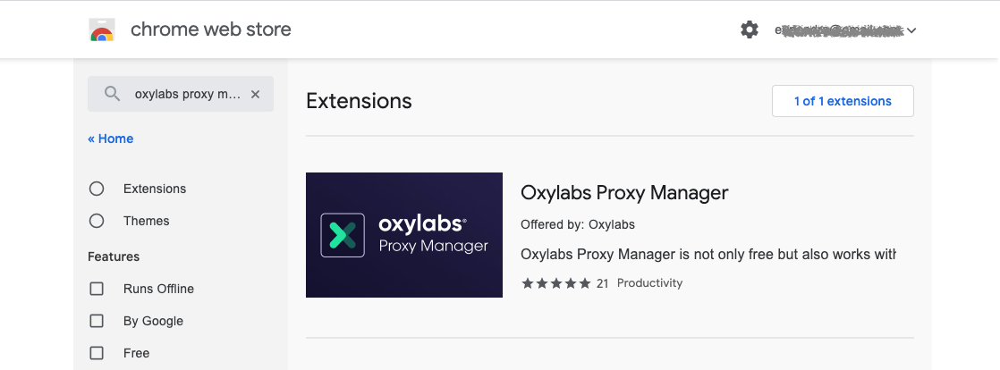

From the search results, click the extension name. 
Alternatively, simply click this [link](https://oxy.yt/ArJV) to open the Oxylabs Proxy Manager extension page.

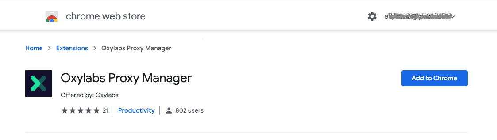

On this page, click Add to Chrome to install this extension to your Chrome browser. You will see a confirmation that the Oxylabs Proxy Manager has been installed. 

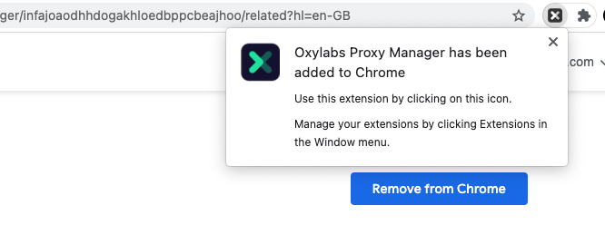

## Adding Proxy 
After installing the Oxylabs Proxy Manager, if you click the icon in the toolbar, you will see the following Proxy Manager application window:

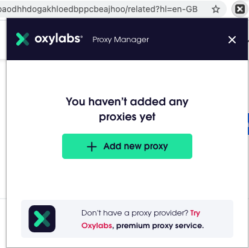

As evident here that no proxy has been added. To use this extension, first, we need to add at least one proxy. 
The button to add a new proxy is conveniently visible. Click the Add New Proxy button to open the Manage Proxies window. On this page, you can add new proxies. When you open it for the first time, it will be a blank table as follows: 

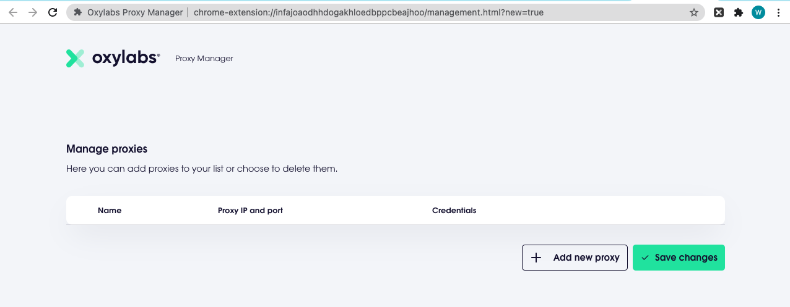

Click the Add New Proxy button to add a new row. In this row you can enter the following information about the proxy that you want to use: 
- Name - This is just a friendly name. 
- Proxy Protocol - Select HTTP, HTTPS, or SOCKS5. 
- Proxy IP - Enter IP address. You can also enter domains such as pr.oxylabs.io depending on your requirements.
- Proxy Port 
- Credentials - Leave blank for anonymous proxies: 
  - Username 
  - Password 
'If you are using Oxylabs proxies, enter pr.oxylabs.com as the proxy IP and 7777 as the port. You would also need to enter your username and password.'
Important: Do not forget to click Save Changes after entering the proxies. 
## Connecting to a Proxy 
Before changing the proxy, it will be a good idea to take note of the current IP address. The simplest way of finding your IP is to do a Google search with a phrase such as What is my IP. 
Your IP address will be listed before the search results. 
Connecting to a proxy is very easy. Click on the Oxylabs Proxy Manager icon. This will bring up the application window. 
In this window, you can see the message "No proxies connected" in red. Simply click the Connect button and you will be connected to a proxy. 

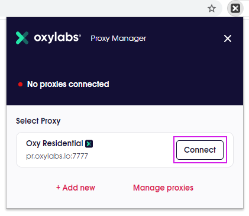

'This screenprint shows the Oxylabs proxy server. However, you can use the Oxylabs Proxy Manager extension with any proxy.'
To verify that you are indeed connected to the correct server, do a Google search with the same phrase what is my ip. You will see that the IP would have changed.

## Adding Multiple Proxies 
Using Oxylabs Proxy Manager, you can add more than one proxy and switch between them easily. 
Click the Proxy Manager icon on the toolbar and then select Manage Proxies. You will be presented with the Manage Proxies screen. You can add as many proxies as needed. Here is sample with multiple proxies: 

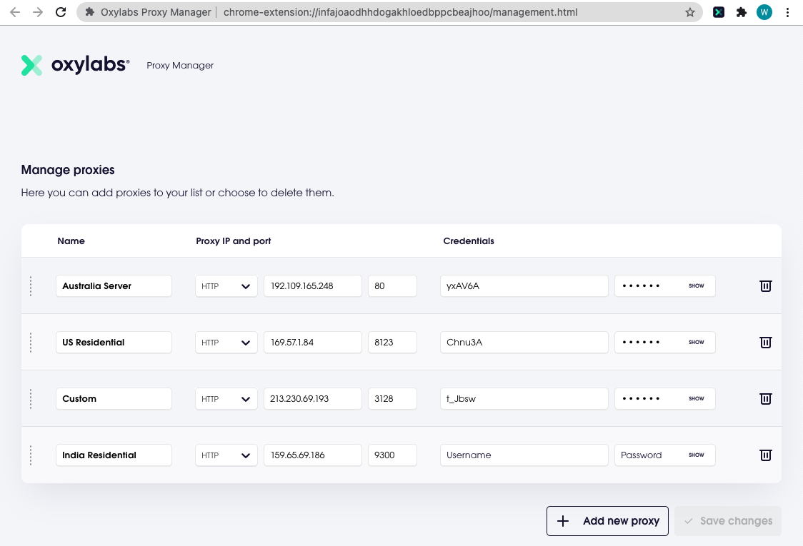

'If you are using Oxylabs proxy servers, you can add multiple country-specific proxy servers. For example, if you put us-pr.oxylabs.io under Proxy server IP and 10001 under Port, you will receive a US exit node with a sticky session. You can add another entry with proxy IP as fr-pr.oxylabs.io and port 40000. This will allow you to switch proxies between US and FR proxies.'
The next section will walk you through the process of using any of these proxies and switch to another as needed. 

## Switching Proxies 
This section will explain how to switch proxies. 
Once you enter multiple proxies in the Manage Proxies dashboard, you can switch proxies very easily. If you click the Oxylabs Proxy Manager icon, you will see all the proxies that you have entered.

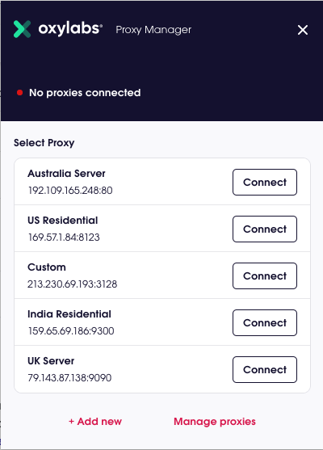

From this application window, click the Connect button located next to the proxy that you want to connect to and you will instantly get connected to that proxy. 
If you want to change the proxy, click the Connect button next to another proxy. 

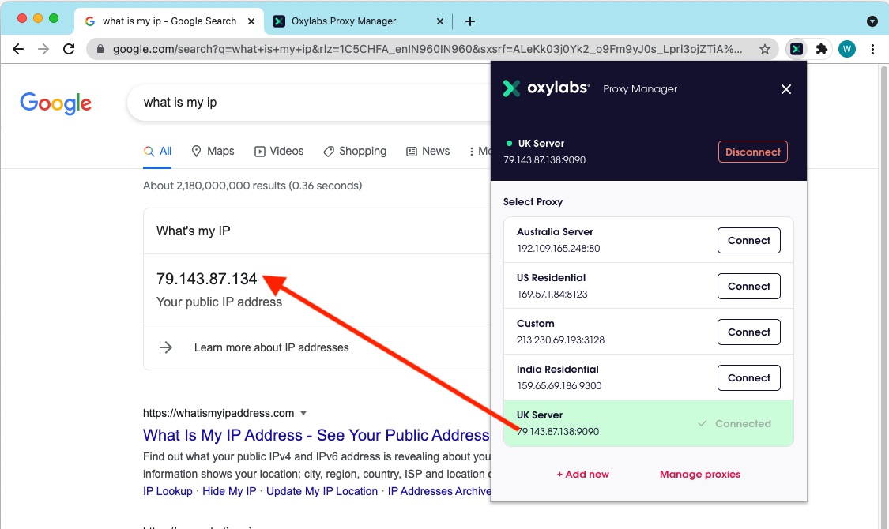

To verify that you are indeed connected to the correct server, do a Google search with the phrase what is my ip. You will see that the IP would have changed. 
You can repeat the steps with any other proxy and you will be able to change proxies easily. 

## Deleting Saved Proxy 
Deleting a saved proxy is as easy as adding a new proxy. Click the extension icon and select Manage proxies. On the Manage Proxies screen, you can delete any proxy by clicking the trashcan icon next to the proxy that you want to delete. 

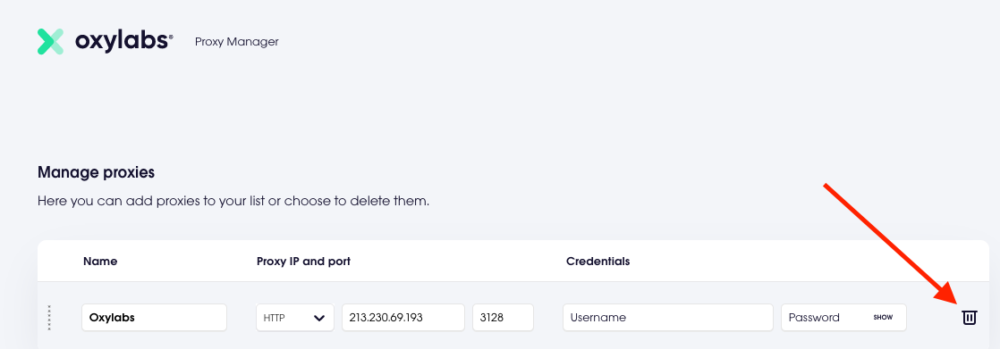

Click Delete on the confirmation dialog andthe proxy will be deleted from the list. 

## Refreshing Oxylabs Proxy
This feature is Oxylabs specific. If you are not using Oxylabs proxy server, you can skip this section. 
If you are connected to an Oxylabs proxy server, you will see an additional button--Refresh Session. This makes it very easy to change proxies.

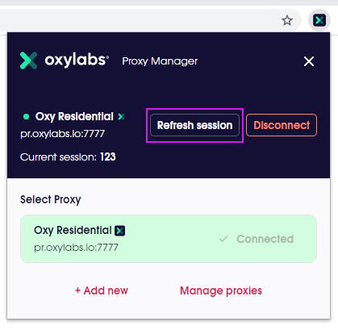

When you connect to Oxylabs proxy server, you are allocated a proxy with specific IP. If you want to change the proxy, simply click Refresh Session to get a new proxy. 

